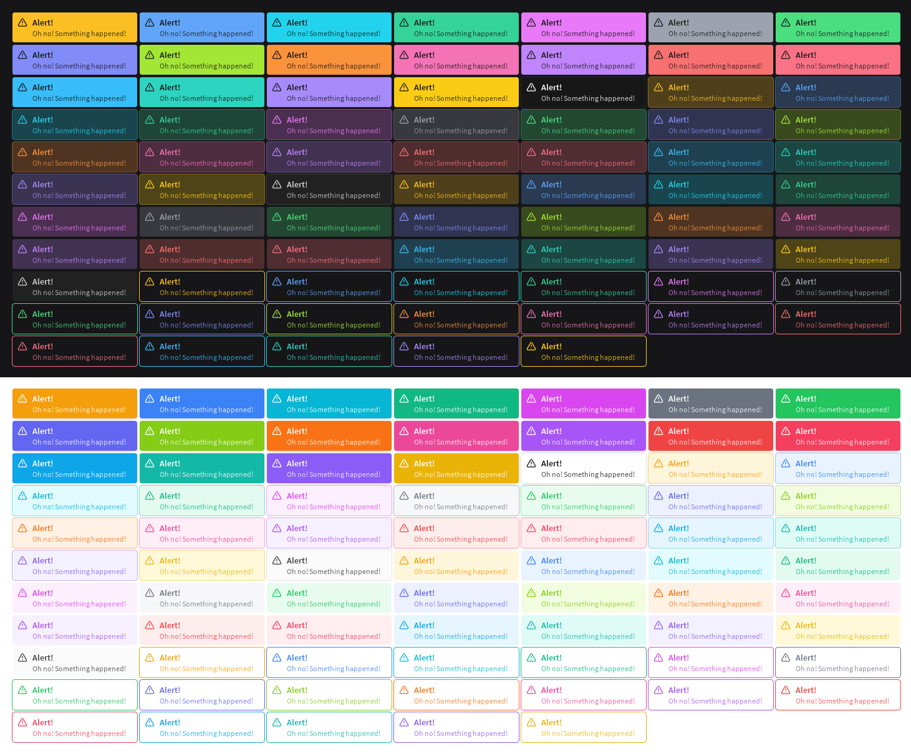
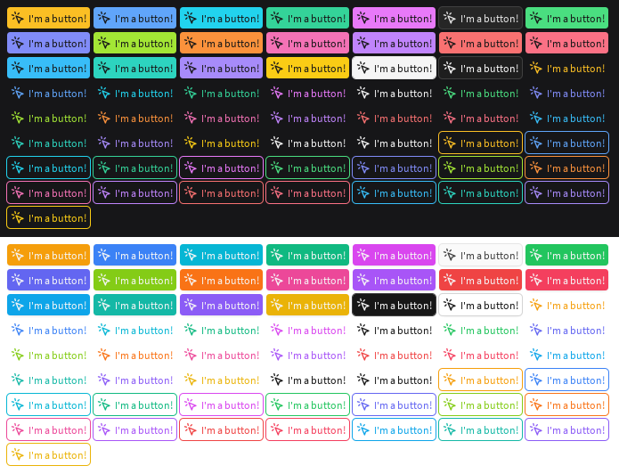
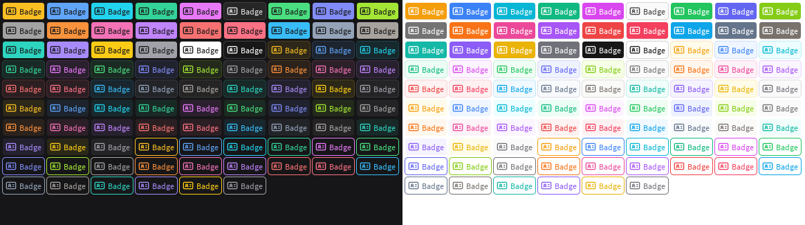
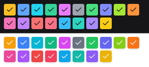

<div align="center">

# FusionComponents

31 beautiful modern components for Fusion 0.2.

[](https://github.com/virtualbutfake/fusion-components/blob/master/LICENSE.md)
[](https://github.com/virtualbutfake/fusion-components/actions)

</div>

## Features

- Built with [Tailwind](https://github.com/virtualbutfake/tailwind) colors and [ThemeFramework](https://github.com/virtualbutfake/theme-framework), providing a consistent look and excellent developer experience.
- 31 components, including buttons, inputs, and modals, suitable for almost every usecase.
- Almost every component can be customized to use any Tailwind color, resulting in a wide range of possible appearances.
- Utilizes [Lucide Icon Set](https://lucide.dev) via [lucide-roblox](https://github.com/virtualbutfake/lucide-roblox), offering a wide range of icons.
- Properties are strongly typed, ensuring a great DX and reducing the risk of runtime errors.
- Seamlessly integrates with your existing Fusion project; Fusion Components tie in with existing codebases and most components take properties that are applied to the instance, for maximum customization.
- Infinite customisability through `AppearanceOverride`s, allowing you to change any aspect of a component's appearance.
- Straightforward theming: Through ThemeFramework, colors, transparencies and shadows for any state can be customized with ease on any component.
- Inspired by Nuxt UI, providing variants that can be used to change the appearance of a component to one of the predefined styles, without having to customize anything else.

<details>
<summary>Demo of a few components</summary>

### [Alert](https://docs.tijne.net/fusioncomponents/components/alert)


### [Button](https://docs.tijne.net/fusioncomponents/components/button)


### [Badge](https://docs.tijne.net/fusioncomponents/components/badge)


### [Checkbox](https://docs.tijne.net/fusioncomponents/components/checkbox)


### [Progress Bar](https://docs.tijne.net/fusioncomponents/components/progressbar)
https://github.com/user-attachments/assets/83b39c68-794b-4cd7-a4f4-079c9a43eda2


### [Slider](https://docs.tijne.net/fusioncomponents/components/slider)
https://github.com/user-attachments/assets/adae33d9-e23a-4b75-8fe0-2856ae1a9e72
</details>

## Getting Started

FusionComponents is available on Wally [here](https://wally.run/package/virtualbutfake/fusion-components).

An extensive guide on how to get started can be found in the [documentation](https://docs.tijne.net/fusioncomponents/getting-started).

## Documentation

The documentation for FusionComponents provides info on every component and its properties. It can be found [here](https://docs.tijne.net/fusioncomponents).

The repository for the documentation can be found [here](https://github.com/virtualbutfake/fusion-components-docs). Because it hosts the documentation for multiple projects, it is a separate repository.

## Contributing

Contributions are always welcomed. Code should follow Stylua and Selene formatting conventions. To contribute, fork this repository, make your changes, and create a pull request. Please make sure to test your changes before creating a pull request.

> [!IMPORTANT]  
> This project currently suffers from the `thread 'main' has overflowed its stack` issue caused by full-moon.
>
> You can fix this by running `ulimit -s 16384` before running the build command on Linux, or by increasing the Darklua executable stack size on Windows. You can do this by installing Visual Studio and opening the `Developer Command Prompt for VS` and running `editbin /STACK:16777216 "C:\Users\<your user>\.aftman\tool-storage\seaofvoices\darklua\0.13.1\darklua.exe"`. While this is by no means a solution, overhauling the project to fix this (hopefully) temporary issue is not a priority at the moment.
>
> If you need help with this, feel free to ping me in the Roblox OSS Discord server.

In order to test your changes, you can run the following commands:

```bash
aftman install
lune run dev
```

This will start a Rojo server. You can test your changes through stories which you can run with [Flipbook](https://github.com/flipbook-labs/flipbook).

## License

This project is licensed under the MIT License - see the [LICENSE.md](https://github.com/virtualbutfake/fusion-components/blob/main/LICENSE.md) file for details.
